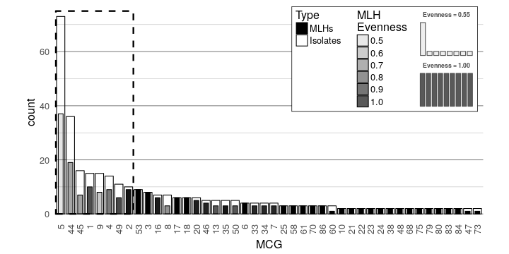
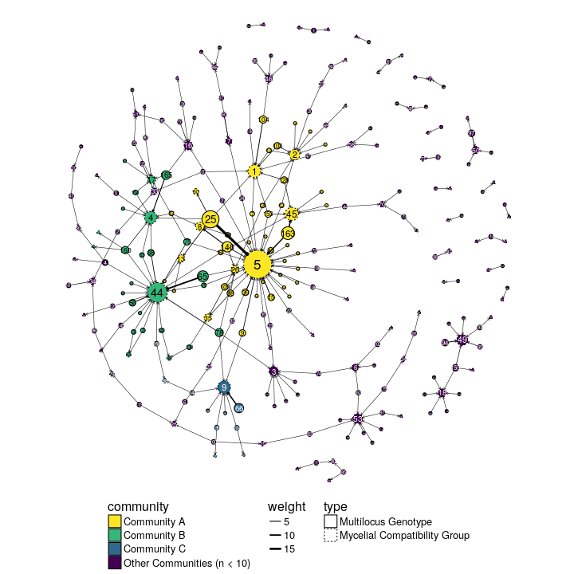
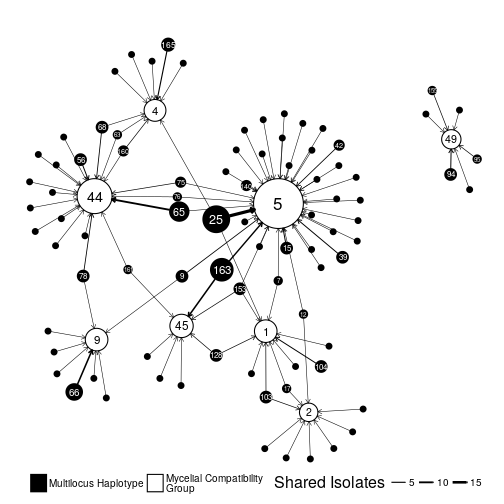

# Introduction 

The purpose of this document is to assess the distribution of the MLGs and MCGs
within the data. Specifically, we want to know if there are any MLGs that 
consistently coordinate with a single MCG, or if there are anything close.

## Packages and Data


```r
library('igraph')
```

```
## 
## Attaching package: 'igraph'
```

```
## The following objects are masked from 'package:stats':
## 
##     decompose, spectrum
```

```
## The following object is masked from 'package:base':
## 
##     union
```

```r
library('ggraph')
```

```
## Loading required package: ggplot2
```

```r
library('tidyverse')
```

```
## Loading tidyverse: tibble
## Loading tidyverse: tidyr
## Loading tidyverse: readr
## Loading tidyverse: purrr
## Loading tidyverse: dplyr
```

```
## Conflicts with tidy packages ----------------------------------------------
```

```
## as_data_frame(): dplyr, tibble, igraph
## compose():       purrr, igraph
## crossing():      tidyr, igraph
## filter():        dplyr, stats
## groups():        dplyr, igraph
## lag():           dplyr, stats
## simplify():      purrr, igraph
```

```r
library('poppr')
```

```
## Loading required package: adegenet
```

```
## Loading required package: ade4
```

```
## 
##    /// adegenet 2.1.0 is loaded ////////////
## 
##    > overview: '?adegenet'
##    > tutorials/doc/questions: 'adegenetWeb()' 
##    > bug reports/feature requests: adegenetIssues()
```

```
## This is poppr version 2.4.1. To get started, type package?poppr
## OMP parallel support: available
```

```
## 
## Attaching package: 'poppr'
```

```
## The following object is masked from 'package:igraph':
## 
##     %>%
```

```r
library('viridis')
```

```
## Loading required package: viridisLite
```


```r
load(file.path(PROJHOME, "data", "sclerotinia_16_loci.rda"))
load(file.path(PROJHOME, "data", "mlg-crosspop-graph.rda"))
dat11
```

```
## 
## This is a genclone object
## -------------------------
## Genotype information:
## 
##    165 original multilocus genotypes 
##    366 haploid individuals
##     11 codominant loci
## 
## Population information:
## 
##      5 strata - MCG, Region, Source, Year, Host
##     14 populations defined - NE, NY, MN, ..., France, Mexico, ND
```

```r
g11o <- igraph::cluster_optimal(graph11loc$total)
comm <- igraph::communities(g11o)
names(comm) <- c("International", "Costal", "Midwest")
comm
```

```
## $International
## [1] "Australia" "France"    "MN"       
## 
## $Costal
## [1] "CA" "NY" "OR" "WA"
## 
## $Midwest
## [1] "CO" "MI" "ND" "NE"
```

```r
strata(dat11) <- strata(dat11) %>%
  mutate(MLGRegion = case_when(
    .$Region %in% comm$International ~ "International",
    .$Region %in% comm$Costal ~ "Costal",
    .$Region %in% comm$Midwest ~ "Midwest",
    TRUE ~ as.character(.$Region)
  ))

setPop(dat11) <- ~MLGRegion
pal <- unlist(map2(LETTERS[2:4], comm, function(a, b) setNames(viridis::viridis(length(b), option = a), b)))
pal <- c(pal, setNames(rep("#F6F6F6FF", 3), c("Mexico", "ID", "WI")))
```


## MLG table

First, it would be nice to visualize the MLGs across populations


```r
mtab <- mlg.table(dat11, color = TRUE)
```


```r
mplot <- last_plot()
mplot + scale_fill_viridis(discrete = TRUE, direction = -1, option = "C") +
  aes(color = I("black")) 
```


Now we can take a look at the concordance of MLGs to MCGs. We can do this by 
creating a contigency table. Of course, since we have 87 and well over 100 MLGs,
this means that the contingency table is going to be big, so to summarize it
further, I'm creating two tables, one based on MLGs that will count the number
of MCGs within each MLG and vice-versa. Of course we lose information like, if
an MCG contains several MLGs, how can we tell what the abundance is? A handy 
measure is Evenness, which scales from 0 to 1, indicating how skewed the 
observations are. 


```r
mll.custom(dat11) <- strata(dat11)$MCG
mcgmlg <- as.data.frame(table(mll(dat11, "original"), mll(dat11, "custom"))) %>%
  setNames(c("MLG", "MCG", "Freq")) %>%
  as_data_frame() %>%
  filter(Freq > 0)
mcgs <- mcgmlg %>%
  group_by(MCG) %>%
  summarize(MLGs = sum(Freq > 0), 
            Samples = sum(Freq), 
            Evenness = diversity_stats(Freq)["E.5"], 
            data = list(data_frame(MLG = MLG, Freq = Freq))) %>%
  arrange(desc(MLGs))
mlgs <- mcgmlg %>%
  group_by(MLG) %>%
  summarize(MCGs = sum(Freq > 0), 
            Samples = sum(Freq), 
            Evenness = diversity_stats(Freq)["E.5"], 
            data = list(data_frame(MCG = MCG, Freq = Freq))) %>%
  arrange(desc(Samples), desc(MCGs))
mcgs
```

```
## # A tibble: 87 × 5
##       MCG  MLGs Samples  Evenness              data
##    <fctr> <int>   <int>     <dbl>            <list>
## 1       5    37      73 0.4811239 <tibble [37 × 2]>
## 2      44    19      36 0.6249418 <tibble [19 × 2]>
## 3       1    10      15 0.8217819 <tibble [10 × 2]>
## 4       4     9      14 0.7242515  <tibble [9 × 2]>
## 5       2     9      10 0.9517005  <tibble [9 × 2]>
## 6      53     9       9 1.0000000  <tibble [9 × 2]>
## 7       3     8       8 1.0000000  <tibble [8 × 2]>
## 8       9     8      15 0.5493741  <tibble [8 × 2]>
## 9      45     7      16 0.6304310  <tibble [7 × 2]>
## 10     16     6       7 0.9371824  <tibble [6 × 2]>
## # ... with 77 more rows
```

```r
mlgs
```

```
## # A tibble: 165 × 5
##       MLG  MCGs Samples  Evenness             data
##    <fctr> <int>   <int>     <dbl>           <list>
## 1      25     5      27 0.5490333 <tibble [5 × 2]>
## 2     163     2      15 0.9955736 <tibble [2 × 2]>
## 3      65     2      11 0.5560301 <tibble [2 × 2]>
## 4     140     3      10 0.9063854 <tibble [3 × 2]>
## 5      66     1       8       NaN <tibble [1 × 2]>
## 6     165     3       7 0.6693363 <tibble [3 × 2]>
## 7      78     4       6 0.8116548 <tibble [4 × 2]>
## 8     160     4       5 0.9218931 <tibble [4 × 2]>
## 9     104     2       5 0.7246677 <tibble [2 × 2]>
## 10     75     3       4 0.9115303 <tibble [3 × 2]>
## # ... with 155 more rows
```

It might be better to visualize these data as barplots. Here we are mapping the
type (MCG/Count) to color and the opacity (alpha) to Evenness.


```r
mcgs %>% 
  gather(type, count, MLGs, Samples, -Evenness) %>%
  arrange(desc(type), desc(count)) %>%
  mutate(MCG = forcats::fct_inorder(MCG, ordered = TRUE)) %>%
  ggplot(aes(x = MCG, y = count, group = type, fill = type, alpha = Evenness)) +
  geom_col(aes(width = ifelse(type == "MLGs", 0.5, 0.85)), color = "black", position = "identity") +
  annotate(geom = "text", x = 13, y = 51, label = sprintf("Mean Evenness: %.3f", mean(mcgs$Evenness, na.rm = TRUE))) +
  scale_fill_viridis(end = 0.75, discrete = TRUE, direction = -1) +
  scale_y_continuous(expand = c(0, 2)) +
  theme_minimal() +
  theme(panel.grid.major.x = element_blank()) +
  theme(axis.text.x = element_text(angle = 90, vjust = 0, hjust = 1)) +
  ggtitle("How Evenly are Multilocus Genotypes (MLGs) spread across MCGs?")
```

```
## Warning: Ignoring unknown aesthetics: width
```



```r
mlgs %>% 
  gather(type, count, MCGs, Samples, -Evenness) %>%
  arrange(desc(type), desc(count)) %>%
  mutate(MLG = forcats::fct_inorder(MLG, ordered = TRUE)) %>%
  ggplot(aes(x = MLG, y = count, group = type, fill = type)) +
  geom_col(aes(width = ifelse(type == "MCGs", 0.5, 0.85), alpha = Evenness), color = "black", position = "identity") +
  annotate(geom = "text", x = 20, y = 21, label = sprintf("Mean Evenness: %.3f", mean(mlgs$Evenness, na.rm = TRUE))) +
  scale_fill_viridis(end = 0.75, discrete = TRUE, direction = -1) +
  scale_y_continuous(expand = c(0, 2)) +
  theme_minimal() +
  theme(panel.grid.major.x = element_blank()) +
  theme(axis.text.x = element_text(angle = 90, vjust = 0, hjust = 1)) +
  ggtitle("How Evenly are MCGs spread across Multilocus Genotypes (MLGs)?")
```

```
## Warning: Ignoring unknown aesthetics: width
```


## making a graph

I believe that making a graph to visualize this might help me understand what the h\*ck is going on. 


```r
make_mcgmlg_graph <- function(x){
  gdf <- mutate(x, MLG = paste0('MLG.', MLG))
  MLGS <- gdf %>% 
    group_by(MLG) %>%
    summarize(size = sum(Freq)) %>%
    rename(vertex = MLG)
  MCGS <- gdf %>% 
    group_by(MCG) %>%
    summarize(size = sum(Freq)) %>%
    rename(vertex = MCG)
  VAT <- bind_rows(MLGS, MCGS)
  g <- gdf %>% 
    select(MCG, MLG, Freq) %>%
    rename(weight = Freq) %>%
    graph_from_data_frame(vertices = VAT)
  V(g)$type <- ifelse(grepl("MLG", V(g)$name), "Multilocus Genotype", "Mycelial Compatibility Group")
  g
}

add_communities <- function(g, clusters){
  comm <- communities(clusters)
  commlist <- setNames(rep(names(comm), lengths(comm)), unlist(comm, use.names = FALSE))
  V(g)$community <- commlist[V(g)$name]
  g
}
g <- make_mcgmlg_graph(mcgmlg)
g <- add_communities(g, cluster_walktrap(g))
osize <- V(g)$size
```

Because I have more control over the size and feel of the graph, I'm going to use
ggraph. Of course, since this IS a complicated data set, It's not going to be
very pretty to look at, but I'm going to save it as supplementary materials
because it's valuable to at least look this ugliness in the face and say, "Yeah,
I guess it's not so simple after all."


```r
V(g)$size <- sqrt(osize)/10
set.seed(2017-05-05)
lay2 <- create_layout(g, layout = "igraph", algorithm = "nicely")

cnames <- LETTERS[1:10]
cnames[c(7, 5, 1)] <- LETTERS[1:3]
the_communities <- data_frame(vertex = lay2$name, community = lay2$community) %>%
  mutate(community = case_when(
    .$community == 7 ~ "A",
    .$community == 5 ~ "B",
    .$community == 1 ~ "C",
    TRUE ~ as.character(.$community)
  )) %>%
  group_by(community) %>%
  mutate(comm = ifelse(n() > 10, paste("Community", community), "Other Communities (n < 10)")) %>%
  mutate(comm = comm) # It just so happens that the communities are in order by size.
lay2$community <- the_communities$comm
mcg_mlg_graph <- ggraph(lay2) +
  geom_node_circle(aes(r = size, lty = type, fill = community)) +
  geom_edge_link(aes(start_cap = circle(node1.size, unit = "native"), 
                     end_cap = circle(node2.size, unit = "native"), 
                     width = weight),
                 arrow = arrow(length = unit(0.01, "native"))) +
  geom_node_text(aes(label = gsub("MLG.", "", name), 
                     color = community, 
                     size = size/10), 
                 show.legend = FALSE) +
  coord_fixed() +
  scale_linetype_manual(values = c(1, 3)) +
  scale_edge_width(range = c(0.25, 1.5)) +
  scale_color_manual(values = c("black", "black", "white", "white")) +
  scale_fill_viridis(direction = -1, discrete = TRUE) +
  theme_graph(base_size = 16, base_family = "Helvetica") +
  theme(legend.position = "bottom", legend.direction = "vertical") +
  ggtitle("Relation of Multilocus Genotypes and MCGs") 
  
mcg_mlg_graph
```



```r
ggsave(file.path(PROJHOME, "results/figures/publication/FigureS2.svg"), 
       width = 88*3, height = 88*3, units = "mm")
```

## Subgraph

So that's a big hairy graph. What happens when we look at a subgraph of the
top 5 MCGs?


```r
top5 <- filter(mcgmlg, as.character(MCG) %in% mcgs$MCG[1:5])
top5g <- make_mcgmlg_graph(top5)
tosize <- V(top5g)$size
V(top5g)$size <- sqrt(tosize)/10
set.seed(2017-05-04)
top5lay <- create_layout(top5g, layout = "igraph", algorithm = "nicely")
top5lay$community <- inner_join(data_frame(vertex = top5lay$name), the_communities)$comm
```

```
## Joining, by = "vertex"
```

```
## Warning in inner_join_impl(x, y, by$x, by$y, suffix$x, suffix$y): joining
## factors with different levels, coercing to character vector
```

```r
t5g <- mcg_mlg_graph %+% top5lay + ggtitle("Top 5 Mycelial Compatibility Groups and associated MLGs")
t5g
```



```r
ggsave(t5g, file = file.path("results", "figures", "publication", "FigureS2B.svg"), width = 88, height = 88, scale = 3, units = "mm")
```

Vey nice!

There are a whole buttload of MLGs for those 5 MCGs. What are the severity 
ratings for those? Again, we take take a look at these AND simultaneously query
the top 5 MLGs for this. 


```r
strat <- bind_cols(strata(dat11), 
                   other(dat11)$meta, 
                   data_frame(MLG = mll(dat11, "original")))
count_group <- . %>% 
  mutate(nobs = n()) %>%  # count the number of samples/MCG
  ungroup() %>%
  arrange(desc(nobs)) # arrange by number of samples and reorder factors 
Severity <- filter(strat, MCG %in% mcgs$MCG[1:5]) %>%
  group_by(MCG) %>% 
  count_group %>%
  mutate(MCG = forcats::fct_inorder(factor(MCG), ordered = TRUE)) %>%
  mutate(MLG = ifelse(MLG %in% mlgs$MLG[1:5], paste("MLG", MLG), "Other")) 
  
severity_plot <- ggplot(Severity, aes(x = MCG, y = Severity)) +
  geom_point(aes(fill = MLG), 
             position = position_jitter(width = 0.2),
             alpha = 0.75,
             pch = 21) +
  scale_fill_viridis(discrete = TRUE, direction = -1) +
  theme_bw() +
  theme(legend.position = "bottom") +
  theme(aspect.ratio = 0.6) +
  facet_wrap(~Region, nrow = 2) +
  ylim(c(3.5, 8)) +
  labs(list(
    title = "Severity by MCG and Region",
    fill = "Multilocus Genotype",
    subtitle = "Five most abundant multilocus genotypes shown"
  ))
severity_plot
```


```r
ggsave(severity_plot, filename = "results/figures/publication/FigureS3.svg", width = 183, unit = "mm")
```

```
## Saving 183 x 102 mm image
```

